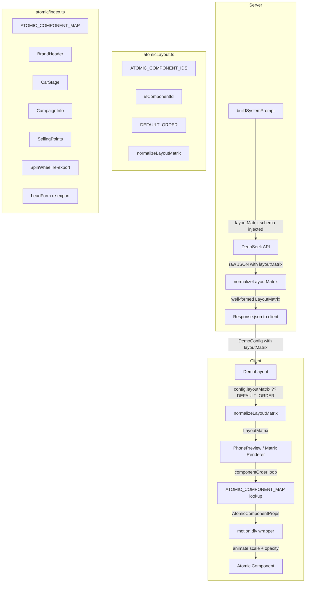

# Design Document: GenUI Atomic Layout System

## Overview

The GenUI Atomic Layout System upgrades the XPENG AI Marketing Demo's phone preview from a fixed JSX template into a fully data-driven rendering pipeline. Instead of a hardcoded component tree, the phone preview becomes a **Matrix Renderer** that iterates over a `componentOrder` array emitted by DeepSeek and renders the corresponding atomic components in that sequence.

The system has three moving parts that must stay in sync:

1. **AI Contract** — `buildSystemPrompt()` instructs DeepSeek to include a `layoutMatrix` field in every response.
2. **Normalization Layer** — `normalizeLayoutMatrix()` in `app/lib/atomicLayout.ts` is a pure function that validates, filters, deduplicates, and fills the AI output so the renderer always receives a well-formed 6-entry `componentOrder`.
3. **Matrix Renderer** — the refactored `PhonePreview` component loops over `componentOrder`, looks up each component in `ATOMIC_COMPONENT_MAP`, and wraps it in a `framer-motion` animated container for position and weight transitions.

The key design principle is that `normalizeLayoutMatrix()` is the single source of truth for fallback logic. It is called in the API route (server-side) before the response is sent to the client, and it is also called in `DemoLayout` (client-side) as a safety net when deriving the `layoutMatrix` prop for `PhonePreview`. This means the renderer never needs to handle malformed input.

### Technology Constraints

- **Next.js 16 / React 19**: All interactive components use the `'use client'` directive. The API route (`app/api/generate/route.ts`) is a Route Handler using the Web `Request`/`Response` APIs — no `NextRequest`/`NextResponse` needed for this feature.
- **framer-motion**: Must be added as a production dependency (`npm install framer-motion`). It is not currently in `package.json`. All animated wrappers in the Matrix Renderer must be Client Components.
- **fast-check**: Already installed as a dev dependency. Used for property-based tests.
- **TypeScript strict mode**: All new types must be fully typed with no `any`.

---

## Architecture



### Data Flow Summary

1. User submits a prompt → `DemoLayout.handleGenerate()` calls `POST /api/generate`.
2. The API route calls `buildSystemPrompt(carModel)` which now includes the `layoutMatrix` JSON schema and a concrete example.
3. DeepSeek returns a JSON blob. The API route calls `normalizeLayoutMatrix()` on the `layoutMatrix` field before returning the full `DemoConfig` to the client.
4. `DemoLayout` receives the new `DemoConfig`, sets it via `setConfig()`, and derives `layoutMatrix` from `config.layoutMatrix` (with `normalizeLayoutMatrix` as a safety net) at render time — no separate state variable.
5. `PhonePreview` receives `layoutMatrix` as a prop and renders the Matrix Renderer loop.
6. Each iteration wraps the atomic component in a `motion.div` with `layout`, `layoutId`, `animate`, and `transition` props for position and weight animations.

---

## Components and Interfaces

### `app/lib/atomicLayout.ts` (new file)

This is a pure TypeScript module with no React imports. It is safe to import from both the API route (server) and client components.

```typescript
// The single source of truth for all valid atomic component IDs
export const ATOMIC_COMPONENT_IDS = [
  'brand_header',
  'car_stage',
  'campaign_info',
  'selling_points',
  'lucky_wheel',
  'lead_form',
] as const;

export type ComponentId = (typeof ATOMIC_COMPONENT_IDS)[number];

export interface ComponentSettings {
  scale?: 'large' | 'small';
  highlight?: boolean;
  displayType?: 'grid' | 'list';
  isBackground?: boolean;
}

export interface LayoutMatrix {
  componentOrder: ComponentId[];
  componentSettings?: Partial<Record<ComponentId, ComponentSettings>>;
}

// Type guard — pure function, no side effects
export function isComponentId(s: string): s is ComponentId {
  return (ATOMIC_COMPONENT_IDS as readonly string[]).includes(s);
}

export const DEFAULT_ORDER: ComponentId[] = [
  'brand_header',
  'car_stage',
  'campaign_info',
  'selling_points',
  'lucky_wheel',
  'lead_form',
];

// Pure normalization function — used by both API route and DemoLayout
export function normalizeLayoutMatrix(raw: unknown): LayoutMatrix {
  // ... implementation described in Data Models section
}
```

### `app/components/atomic/` (new directory)

All atomic components share the same props interface:

```typescript
interface AtomicComponentProps {
  config: DemoConfig;
  tokens: ThemeTokens;
  settings: ComponentSettings;
  // Only used by lucky_wheel and lead_form slots:
  isFormSubmitted?: boolean;
  onSubmitSuccess?: () => void;
}
```

| File | Component | Notes |
|------|-----------|-------|
| `BrandHeader.tsx` | `BrandHeader` | New component. Renders XPENG brand bar with logo text and tag badge. |
| `CarStage.tsx` | `CarStage` | New component. Renders car model name + halo/gradient stage. Respects `settings.isBackground`. |
| `CampaignInfo.tsx` | `CampaignInfo` | New component. Renders `config.title` and `config.subtitle`. |
| `SellingPoints.tsx` | `SellingPoints` | New component. Renders `config.sellingPoints` cards. Respects `settings.displayType`. |
| `index.ts` | `ATOMIC_COMPONENT_MAP` | Re-exports all components + the map. |

`SpinWheel` and `LeadForm` are **not** moved — they are imported from their existing locations and referenced in `ATOMIC_COMPONENT_MAP`.

```typescript
// app/components/atomic/index.ts
import type { ComponentId } from '@/app/lib/atomicLayout';
import type { AtomicComponentProps } from './types';
import BrandHeader from './BrandHeader';
import CarStage from './CarStage';
import CampaignInfo from './CampaignInfo';
import SellingPoints from './SellingPoints';
import SpinWheel from '../SpinWheel';   // reused as-is
import LeadForm from '../LeadForm';     // reused as-is

export const ATOMIC_COMPONENT_MAP: Record<
  ComponentId,
  React.ComponentType<AtomicComponentProps>
> = {
  brand_header: BrandHeader,
  car_stage: CarStage,
  campaign_info: CampaignInfo,
  selling_points: SellingPoints,
  lucky_wheel: SpinWheel as React.ComponentType<AtomicComponentProps>,
  lead_form: LeadForm as React.ComponentType<AtomicComponentProps>,
};
```

> **Note on SpinWheel/LeadForm prop adaptation**: `SpinWheel` expects `prizes`, `isFormSubmitted`, and `themeTokens` props. `LeadForm` expects `onSubmitSuccess` and `themeTokens`. The Matrix Renderer passes `AtomicComponentProps` uniformly; the cast is safe because the renderer always passes `config`, `tokens`, `settings`, `isFormSubmitted`, and `onSubmitSuccess`. Each component uses only the props it needs. A thin adapter wrapper per component is an alternative if strict prop typing is preferred — the design leaves this as an implementation decision.

### `app/components/PhonePreview.tsx` (refactored)

The Matrix Renderer loop replaces all hardcoded JSX sections:

```typescript
// Conceptual structure — not final code
import { AnimatePresence, motion } from 'framer-motion';
import { ATOMIC_COMPONENT_MAP } from './atomic';
import { normalizeLayoutMatrix } from '@/app/lib/atomicLayout';

// Scale/opacity derivation (pure function)
function resolveAnimateProps(settings: ComponentSettings) {
  const scale =
    settings.scale === 'large' ? 1.15
    : settings.scale === 'small' ? 0.9
    : 1.0;

  const opacity =
    settings.highlight === true ? 1.0
    : settings.isBackground === true ? 0.35
    : 0.85;

  return { scale, opacity };
}

const SPRING = { type: 'spring', stiffness: 200, damping: 25 } as const;

// Inside the scrollable content area:
<AnimatePresence>
  {layoutMatrix.componentOrder.map((componentId) => {
    const Component = ATOMIC_COMPONENT_MAP[componentId];
    if (!Component) return null; // skip unknown IDs
    const settings = layoutMatrix.componentSettings?.[componentId] ?? {};
    const { scale, opacity } = resolveAnimateProps(settings);
    return (
      <motion.div
        key={componentId}          // stable key — prevents unmount on reorder
        layoutId={componentId}     // framer-motion position tracking
        layout                     // enables automatic position interpolation
        animate={{ scale, opacity }}
        transition={SPRING}
      >
        <Component
          config={config}
          tokens={themeTokens}
          settings={settings}
          isFormSubmitted={isFormSubmitted}
          onSubmitSuccess={onFormSubmit}
        />
      </motion.div>
    );
  })}
</AnimatePresence>
```

### `app/components/DemoLayout.tsx` (modified)

The only change is deriving `layoutMatrix` from `config` at render time:

```typescript
// Derived at render time — no new state variable
const layoutMatrix: LayoutMatrix = normalizeLayoutMatrix(config.layoutMatrix);
```

And passing it to `PhonePreview`:

```typescript
<PhonePreview
  config={config}
  previewKey={previewKey}
  isFormSubmitted={isFormSubmitted}
  onFormSubmit={handleFormSubmit}
  themeTokens={themeTokens}
  layoutMatrix={layoutMatrix}   // new prop
/>
```

### `app/api/generate/route.ts` (modified)

`buildSystemPrompt()` gains the `layoutMatrix` schema injection. The POST handler calls `normalizeLayoutMatrix()` before returning:

```typescript
// After parsing AI JSON:
const normalized = normalizeLayoutMatrix(parsed?.layoutMatrix);
return Response.json({ ...parsed, layoutMatrix: normalized }, { status: 200 });
```

---

## Data Models

### `LayoutMatrix` normalization algorithm

`normalizeLayoutMatrix(raw: unknown): LayoutMatrix` implements the following steps in order:

1. **Guard**: If `raw` is not an object, or `raw.componentOrder` is not a non-empty array, return `{ componentOrder: [...DEFAULT_ORDER] }`.
2. **Filter**: Keep only entries where `isComponentId(entry)` returns `true`.
3. **Deduplicate**: Walk the filtered array left-to-right; keep only the first occurrence of each `ComponentId`.
4. **Complete**: For each `ComponentId` in `DEFAULT_ORDER` that is not yet in the result, append it.
5. **Settings**: Preserve `raw.componentSettings` if it is a plain object; otherwise omit it. Unknown keys in `componentSettings` are silently ignored at render time (the renderer only looks up valid `ComponentId` keys).
6. **Return**: `{ componentOrder: result, componentSettings: raw.componentSettings ?? undefined }`.

This function is **pure** — same input always produces same output, no side effects.

### `DemoConfig` extension

```typescript
// app/config.ts — addition only, no breaking changes
import type { LayoutMatrix } from './lib/atomicLayout';

export interface DemoConfig {
  theme: string;
  carModel: string;
  tag: string;
  title: string;
  subtitle: string;
  sellingPoints: string[];
  prizes: Prize[];
  layoutMatrix?: LayoutMatrix;  // new optional field
}
```

### Scale/Opacity resolution table

| `scale` | `highlight` | `isBackground` | Resolved `scale` | Resolved `opacity` |
|---------|-------------|----------------|------------------|--------------------|
| `"large"` | `true` | any | 1.15 | 1.0 |
| `"large"` | `false`/absent | `true` | 1.15 | 0.35 |
| `"large"` | `false`/absent | `false`/absent | 1.15 | 0.85 |
| `"small"` | `true` | any | 0.9 | 1.0 |
| `"small"` | `false`/absent | `true` | 0.9 | 0.35 |
| `"small"` | `false`/absent | `false`/absent | 0.9 | 0.85 |
| absent/other | `true` | any | 1.0 | 1.0 |
| absent/other | `false`/absent | `true` | 1.0 | 0.35 |
| absent/other | `false`/absent | `false`/absent | 1.0 | 0.85 |

**Precedence rule**: `highlight=true` always wins over `isBackground=true` for opacity.

### System Prompt `layoutMatrix` schema injection

The updated `buildSystemPrompt()` appends the following block (in Chinese, matching the existing prompt language):

```
layoutMatrix 字段必须包含在返回的 JSON 中，格式如下：
{
  "layoutMatrix": {
    "componentOrder": ["brand_header", "car_stage", "campaign_info", "selling_points", "lucky_wheel", "lead_form"],
    "componentSettings": {
      "lucky_wheel": { "scale": "large", "highlight": true },
      "car_stage": { "isBackground": false },
      "selling_points": { "displayType": "grid" }
    }
  }
}
componentOrder 必须包含全部六个组件 ID（顺序由 AI 根据活动主题决定）：
"brand_header", "car_stage", "campaign_info", "selling_points", "lucky_wheel", "lead_form"
componentSettings 为可选对象，键为组件 ID，值可包含：
  scale: "large" | "small"
  highlight: true | false
  displayType: "grid" | "list"
  isBackground: true | false
```

---

## Correctness Properties

*A property is a characteristic or behavior that should hold true across all valid executions of a system — essentially, a formal statement about what the system should do. Properties serve as the bridge between human-readable specifications and machine-verifiable correctness guarantees.*

### Property 1: `isComponentId` is equivalent to membership in `ATOMIC_COMPONENT_IDS`

*For any* string `s`, `isComponentId(s)` returns `true` if and only if `s` is one of the six values in `ATOMIC_COMPONENT_IDS`, and `false` for all other strings.

**Validates: Requirements 1.5**

---

### Property 2: `buildSystemPrompt` always mentions all six component IDs

*For any* valid `CarModelId`, the string returned by `buildSystemPrompt(carModelId)` contains all six `ComponentId` values: `"brand_header"`, `"car_stage"`, `"campaign_info"`, `"selling_points"`, `"lucky_wheel"`, `"lead_form"`.

**Validates: Requirements 2.1, 2.2**

---

### Property 3: Normalization fallback for invalid/missing `componentOrder`

*For any* input where `layoutMatrix.componentOrder` is absent, not an array, or an empty array, `normalizeLayoutMatrix()` returns a `LayoutMatrix` whose `componentOrder` is exactly `DEFAULT_ORDER`.

**Validates: Requirements 2.6, 3.2, 9.1, 9.2**

---

### Property 4: Normalization filters unknown IDs and completes to six entries

*For any* array of strings passed as `componentOrder`, `normalizeLayoutMatrix()` returns a `componentOrder` that: (a) contains only valid `ComponentId` values, (b) has no duplicates, (c) contains exactly all six `ComponentId` values, and (d) preserves the relative order of valid IDs from the input, appending missing ones in `DEFAULT_ORDER` sequence.

**Validates: Requirements 3.3, 3.4, 3.5, 9.3, 9.5**

---

### Property 5: Normalization preserves existing `DemoConfig` fields (round-trip)

*For any* `DemoConfig` object, attaching a normalized `layoutMatrix` to it and returning it from the API route leaves all other fields (`theme`, `carModel`, `tag`, `title`, `subtitle`, `sellingPoints`, `prizes`) identical to the original values.

**Validates: Requirements 3.6, 3.7**

---

### Property 6: Matrix Renderer renders exactly six components for any valid `LayoutMatrix`

*For any* `LayoutMatrix` produced by `normalizeLayoutMatrix()`, the Matrix Renderer renders exactly six atomic component wrappers in the DOM.

**Validates: Requirements 5.5, 9.5**

---

### Property 7: Matrix Renderer preserves `componentOrder` sequence

*For any* valid `LayoutMatrix`, the top-to-bottom DOM order of rendered atomic components matches the `componentOrder` array exactly.

**Validates: Requirements 5.1, 5.2**

---

### Property 8: Matrix Renderer passes correct `settings` to each component

*For any* `LayoutMatrix` with a `componentSettings` map, each rendered atomic component receives the `settings` object from `componentSettings[componentId]`, or an empty object `{}` if no entry exists for that `ComponentId`.

**Validates: Requirements 5.3, 5.4**

---

### Property 9: Scale animation value is determined solely by `settings.scale`

*For any* `ComponentSettings` object, `resolveAnimateProps(settings).scale` equals `1.15` when `scale === "large"`, `0.9` when `scale === "small"`, and `1.0` for any other value (including `undefined`).

**Validates: Requirements 7.1, 7.2, 7.3**

---

### Property 10: Opacity animation respects `highlight` and `isBackground` precedence

*For any* `ComponentSettings` object, `resolveAnimateProps(settings).opacity` equals `1.0` when `highlight === true` (regardless of `isBackground`), `0.35` when `isBackground === true` and `highlight` is `false` or absent, and `0.85` otherwise.

**Validates: Requirements 7.4, 7.5, 7.7, 7.8**

---

### Property 11: `DemoLayout` always passes a complete `LayoutMatrix` to `PhonePreview`

*For any* `DemoConfig` (with or without `layoutMatrix`), the `layoutMatrix` prop passed to `PhonePreview` by `DemoLayout` is a `LayoutMatrix` whose `componentOrder` contains exactly all six `ComponentId` values.

**Validates: Requirements 8.3, 8.4**

---

### Property 12: `SellingPoints` renders all selling points regardless of `displayType`

*For any* `config.sellingPoints` array and any `settings.displayType` value, the `SellingPoints` component renders all selling point strings in the output.

**Validates: Requirements 4.5, 4.7**

---

### Property 13: `CampaignInfo` renders both `title` and `subtitle` for any config

*For any* `DemoConfig`, the `CampaignInfo` component renders both `config.title` and `config.subtitle` in the output.

**Validates: Requirements 4.4**

---

## Error Handling

### API Route errors

| Scenario | Behavior |
|----------|----------|
| AI returns JSON without `layoutMatrix` | `normalizeLayoutMatrix(undefined)` returns `DEFAULT_ORDER` matrix; response is still valid |
| AI returns `layoutMatrix.componentOrder` with unknown IDs | Filter + complete step produces a valid 6-entry array |
| AI returns `layoutMatrix.componentOrder` with duplicates | Deduplication step retains first occurrence |
| AI returns malformed JSON entirely | Existing `JSON.parse` catch block returns `{ error: 'Invalid JSON from AI' }` with status 500 |
| DeepSeek timeout | Existing `AbortSignal.timeout` handling returns `{ error: 'AI service timeout' }` with status 502 |

### Client-side errors

| Scenario | Behavior |
|----------|----------|
| `config.layoutMatrix` is `undefined` (e.g. first load with static config) | `normalizeLayoutMatrix(undefined)` in `DemoLayout` returns `DEFAULT_ORDER` matrix |
| `ATOMIC_COMPONENT_MAP[componentId]` lookup returns `undefined` | Matrix Renderer returns `null` for that entry; no crash |
| `componentSettings` contains unknown keys | Renderer only looks up valid `ComponentId` keys; unknown keys are silently ignored |
| framer-motion `layout` animation during rapid re-renders | `AnimatePresence` handles interrupted animations gracefully; stable `key` prevents unmount |

### Graceful degradation guarantee

The combination of `normalizeLayoutMatrix()` being called at both the API layer and the `DemoLayout` render layer means the Matrix Renderer is **always** given a well-formed `LayoutMatrix` with exactly six valid `ComponentId` entries. The renderer's `null` guard for unknown IDs is a belt-and-suspenders safety net, not the primary defense.

---

## Testing Strategy

### Unit tests (example-based)

Located in `__tests__/`:

- `atomicLayout.test.ts` — tests for `isComponentId`, `normalizeLayoutMatrix`, `DEFAULT_ORDER` constant, `ATOMIC_COMPONENT_IDS` constant.
- `atomic/BrandHeader.test.tsx` — renders with various `DemoConfig` and `ThemeTokens` combinations.
- `atomic/CarStage.test.tsx` — includes `isBackground=true` opacity check.
- `atomic/CampaignInfo.test.tsx` — verifies title and subtitle rendering.
- `atomic/SellingPoints.test.tsx` — verifies grid vs list layout switching.
- `PhonePreview.test.tsx` — updated to test Matrix Renderer with various `LayoutMatrix` inputs.
- `DemoLayout.test.tsx` — updated to verify `layoutMatrix` prop derivation and fallback.
- `api/generate.test.ts` — updated to verify `layoutMatrix` normalization in the POST handler.

### Property-based tests (fast-check)

The project already has `fast-check` installed. Property tests are co-located with unit tests or in a dedicated `__tests__/properties/` directory.

**PBT library**: `fast-check` (already in `devDependencies`).

**Minimum iterations**: 100 per property test (fast-check default is 100 runs).

**Tag format**: Each property test is annotated with a comment:
```typescript
// Feature: genui-atomic-layout, Property N: <property_text>
```

#### Property tests to implement:

**Property 1** — `isComponentId` membership equivalence:
```typescript
// Feature: genui-atomic-layout, Property 1: isComponentId is equivalent to membership in ATOMIC_COMPONENT_IDS
fc.assert(fc.property(fc.string(), (s) => {
  return isComponentId(s) === ATOMIC_COMPONENT_IDS.includes(s as ComponentId);
}));
```

**Property 2** — `buildSystemPrompt` contains all six component IDs:
```typescript
// Feature: genui-atomic-layout, Property 2: buildSystemPrompt always mentions all six component IDs
fc.assert(fc.property(fc.constantFrom(...CAR_MODEL_IDS), (carModel) => {
  const prompt = buildSystemPrompt(carModel);
  return ATOMIC_COMPONENT_IDS.every((id) => prompt.includes(id));
}));
```

**Property 3** — Normalization fallback for invalid input:
```typescript
// Feature: genui-atomic-layout, Property 3: Normalization fallback for invalid/missing componentOrder
fc.assert(fc.property(
  fc.oneof(fc.constant(undefined), fc.constant(null), fc.constant({}),
           fc.record({ componentOrder: fc.constant([]) }),
           fc.record({ componentOrder: fc.string() })),
  (raw) => {
    const result = normalizeLayoutMatrix(raw);
    return JSON.stringify(result.componentOrder) === JSON.stringify(DEFAULT_ORDER);
  }
));
```

**Property 4** — Normalization produces valid, complete, deduplicated output:
```typescript
// Feature: genui-atomic-layout, Property 4: Normalization filters unknown IDs and completes to six entries
fc.assert(fc.property(fc.array(fc.string()), (arr) => {
  const result = normalizeLayoutMatrix({ componentOrder: arr });
  const order = result.componentOrder;
  // All six present
  const hasAll = ATOMIC_COMPONENT_IDS.every((id) => order.includes(id));
  // No duplicates
  const noDups = new Set(order).size === order.length;
  // Only valid IDs
  const allValid = order.every(isComponentId);
  // Exactly six
  const exactlySix = order.length === 6;
  return hasAll && noDups && allValid && exactlySix;
}));
```

**Property 5** — Round-trip preservation of `DemoConfig` fields:
```typescript
// Feature: genui-atomic-layout, Property 5: Normalization preserves existing DemoConfig fields
fc.assert(fc.property(arbitraryDemoConfig(), (config) => {
  const normalized = { ...config, layoutMatrix: normalizeLayoutMatrix(config.layoutMatrix) };
  return (
    normalized.theme === config.theme &&
    normalized.carModel === config.carModel &&
    normalized.tag === config.tag &&
    normalized.title === config.title &&
    normalized.subtitle === config.subtitle &&
    JSON.stringify(normalized.sellingPoints) === JSON.stringify(config.sellingPoints) &&
    JSON.stringify(normalized.prizes) === JSON.stringify(config.prizes)
  );
}));
```

**Properties 6–8** — Matrix Renderer rendering properties: use React Testing Library to render `PhonePreview` with generated `LayoutMatrix` values and assert on the rendered DOM.

**Properties 9–10** — `resolveAnimateProps` is a pure function; test directly with generated `ComponentSettings` objects.

**Properties 11–13** — Render `DemoLayout` / atomic components with generated props and assert on rendered output.

### Integration tests

- Manual verification of framer-motion layout transitions (visual inspection during development).
- End-to-end test: submit a prompt, verify the phone preview renders six components in the AI-specified order.

### What is NOT property-tested

- framer-motion animation timing and spring physics (visual, not unit-testable).
- `CarStage` CSS opacity rendering (example-based test with `isBackground=true`).
- `buildSystemPrompt` JSON example format (example-based test checking for `"componentOrder"` substring).
- `DemoConfig` type extensions (compile-time TypeScript checks).
