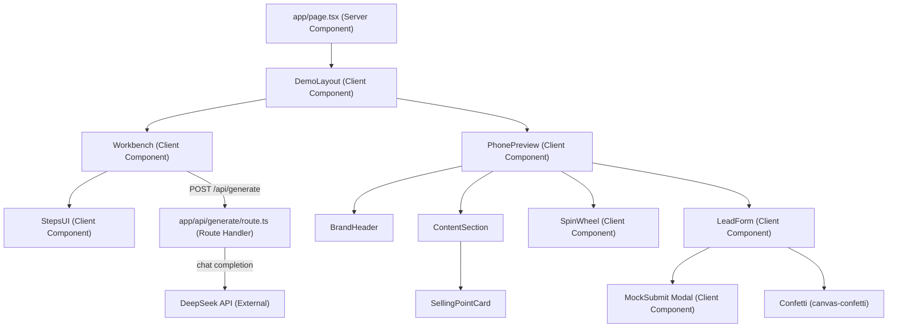
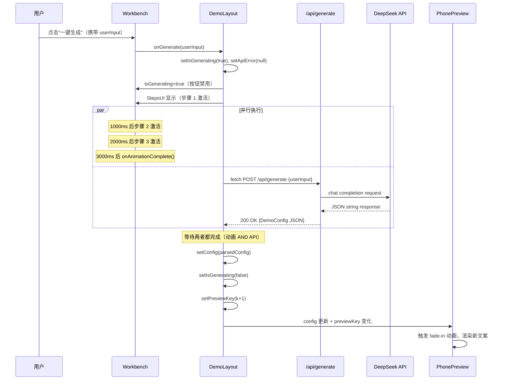
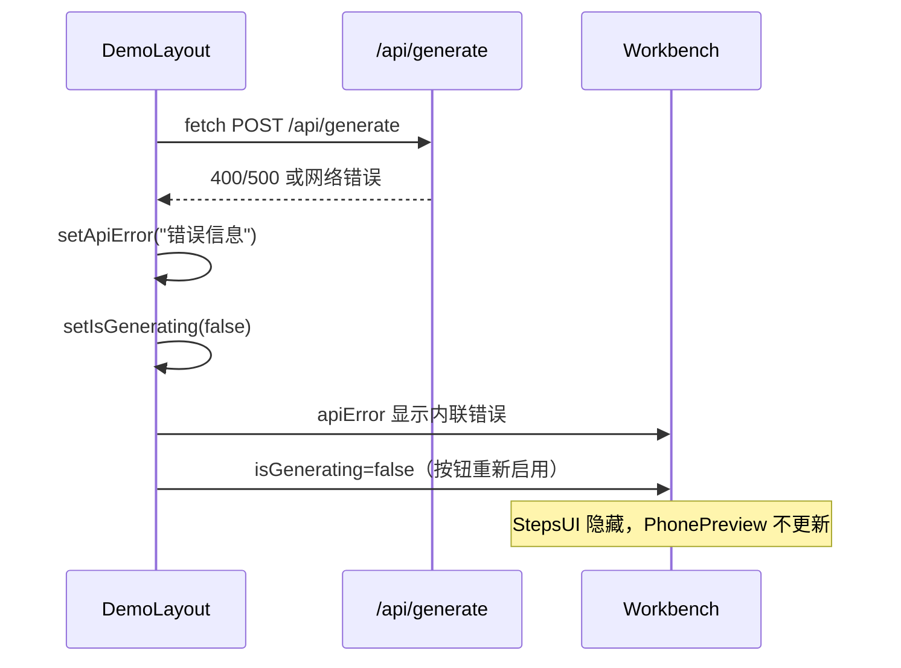

# Design Document: 小鹏 GX Demo 平台

## Overview

本设计文档描述小鹏 GX 门店活动 AI 一键生成 Demo 平台的技术实现方案。该平台是一个 Next.js 16 App Router 应用，采用"左侧 AI 工作台 + 右侧手机端 H5 预览"的双栏布局。

**v2 更新**：平台现已接入真实后端 API 路由 `/api/generate`，通过 DeepSeek 大模型根据销售人员的自然语言输入动态生成活动文案 JSON，替换原有静态 Config。前端新增 StepsUI 三步骤加载动画提升等待体验，LeadForm 提交改为内存态 MockSubmit 弹窗，完整保留演示闭环。

技术栈：
- **Next.js 16** (App Router)
- **React 19**
- **Tailwind CSS v4**（使用 `@import "tailwindcss"` 语法）
- **TypeScript**
- **canvas-confetti**（全屏彩带动画）
- **DeepSeek API**（chat completion，通过后端路由代理调用）

---

## Architecture

整个应用为单页架构，入口为 `app/page.tsx`（Server Component），负责布局骨架。所有交互逻辑下沉到 `app/components/` 目录下的 Client Components。



### 状态管理

所有状态集中在 `DemoLayout` 中，通过 props 向下传递：

```
DemoLayout state:
  - isGenerating: boolean        // 控制 loading 状态
  - isFormSubmitted: boolean     // 控制转盘是否可用
  - previewKey: number           // 触发 PhonePreview 刷新动画
  - config: DemoConfig           // 初始为静态 config，API 返回后替换
  - apiError: string | null      // API 调用失败时的错误信息
```

---

## Components and Interfaces

### 1. Config 类型定义

```typescript
// app/config.ts
export interface Prize {
  id: number;
  name: string;
}

export interface DemoConfig {
  theme: string;
  carModel: string;
  tag: string;
  title: string;
  subtitle: string;
  sellingPoints: string[];
  prizes: Prize[];
}

export const config: DemoConfig = {
  theme: "luxury_ai",
  carModel: "小鹏 GX",
  tag: "AI新豪华大六座SUV旗舰",
  title: "小鹏 GX 智享品鉴礼遇",
  subtitle: "预约首批进店品鉴，100%赢取上市限定豪华周边",
  sellingPoints: [
    "✨ AI 新豪华旗舰：六座宽奢大空间，打造前所未有的全感官高定座舱",
    "☕ 专属Fellow接待：成功留资即刻锁定 1对1 豪华产品专家尊享品鉴方案",
    "🎁 首批品鉴特权：限时进店即赠首发精美随手礼，现场体验大六座空间美美学"
  ],
  prizes: [
    { id: 1, name: "小鹏 GX 1:18 高精车模" },
    { id: 2, name: "新豪华大六座定制车载香薰" },
    { id: 3, name: "小鹏上市限定多功能折叠箱" },
    { id: 4, name: "门店尊享特调咖啡兑换券" }
  ]
};
```

### 2. DemoLayout

**文件：** `app/components/DemoLayout.tsx`  
**指令：** `'use client'`

```typescript
interface DemoLayoutProps {
  initialConfig: DemoConfig;
}
```

负责：
- 持有全局状态（isGenerating, isFormSubmitted, previewKey, config, apiError）
- 渲染双栏布局（左 40% 工作台 + 右 60% 手机预览）
- 执行 `handleGenerate`：调用 `/api/generate`，协调 StepsUI 动画与 API 响应时序
- 将状态和回调传递给子组件

**扩展后的状态定义：**

```typescript
const [isGenerating, setIsGenerating] = useState<boolean>(false);
const [isFormSubmitted, setIsFormSubmitted] = useState<boolean>(false);
const [previewKey, setPreviewKey] = useState<number>(0);
const [config, setConfig] = useState<DemoConfig>(initialConfig);
const [apiError, setApiError] = useState<string | null>(null);
```

### 3. Workbench

**文件：** `app/components/Workbench.tsx`  
**指令：** `'use client'`

```typescript
interface WorkbenchProps {
  isGenerating: boolean;
  apiError: string | null;
  onGenerate: (userInput: string) => void;
}
```

负责：
- 渲染 textarea（预设文案，可编辑）
- 渲染"一键生成"按钮（isGenerating 时禁用）
- 渲染 StepsUI（isGenerating 为 true 时显示，替代原 AILogPanel）
- 渲染 apiError 内联错误信息（apiError 非 null 时显示）

### 4. StepsUI（替代 AILogPanel）

**文件：** `app/components/StepsUI.tsx`  
**指令：** `'use client'`

```typescript
interface StepsUIProps {
  isVisible: boolean;
  onAnimationComplete: () => void; // 三步全部激活后回调
}

const STEP_MESSAGES = [
  "正在解析您的活动想法...",
  "正在注入小鹏 GX AI新豪华大六座SUV旗舰核心卖点...",
  "页面文案组装完毕，正在渲染预览...",
];
```

实现逻辑：
- 使用 `useState` 维护已激活的步骤数（activeCount，0~3）
- 使用 `useEffect` + `setTimeout` 每 1000ms 递增 activeCount
- 每步激活时显示 ✓ 勾选标记和高亮样式
- 三步全部激活（activeCount === 3）后调用 `onAnimationComplete()`
- isVisible 变为 false 时重置 activeCount 为 0

> **注意**：原 `AILogPanel` 组件保留文件，但在 Workbench 中由 StepsUI 替代渲染。

### 5. PhonePreview

**文件：** `app/components/PhonePreview.tsx`  
**指令：** `'use client'`

```typescript
interface PhonePreviewProps {
  config: DemoConfig;
  previewKey: number;
  isFormSubmitted: boolean;
  onFormSubmit: () => void;
}
```

负责：
- 渲染 iPhone 外壳（Tailwind CSS 模拟）
- 内部可滚动内容区域
- 使用 previewKey 触发 CSS 过渡动画（key 变化时 React 重新挂载，触发 fade-in）

### 6. SpinWheel

**文件：** `app/components/SpinWheel.tsx`  
**指令：** `'use client'`

```typescript
interface SpinWheelProps {
  prizes: Prize[];
  isFormSubmitted: boolean;
}
```

实现方案（纯 CSS + SVG）：
- 使用 SVG `<path>` 绘制四个扇形，每个扇形 90°
- 扇形颜色交替使用 #00D4AA 和 #1A1A2E（深色）
- 文字使用 SVG `<text>` 元素，沿扇形中线排列
- 旋转动画：通过 CSS `transform: rotate()` + `transition` 实现
- 随机停止角度：`targetAngle = 360 * 5 + randomSectorAngle`（5圈 + 随机扇区）
- 使用 `useState` 维护 rotation 和 isSpinning 状态

扇形角度计算：
```
sector 0: 0°   ~ 90°   (奖品 0)
sector 1: 90°  ~ 180°  (奖品 1)
sector 2: 180° ~ 270°  (奖品 2)
sector 3: 270° ~ 360°  (奖品 3)
```

### 7. LeadForm

**文件：** `app/components/LeadForm.tsx`  
**指令：** `'use client'`

```typescript
interface LeadFormProps {
  onSubmitSuccess: () => void;
}
```

负责：
- 渲染姓名和手机号输入框
- 客户端验证（非空校验）
- 提交成功后：
  1. 调用 canvas-confetti 全屏彩带
  2. 显示 MockSubmit 弹窗（`[Mock] 提交成功！`）
  3. 通过 onSubmitSuccess 回调通知父组件（设置 formSubmitted = true）
- 弹窗关闭后，表单替换为成功消息展示

### 8. MockSubmit Modal

**文件：** `app/components/MockSubmit.tsx`（或内联于 LeadForm）  
**指令：** `'use client'`

```typescript
interface MockSubmitProps {
  isVisible: boolean;
  onClose: () => void;
}
```

实现逻辑：
- 弹窗内容：精确文本 `"[Mock] 提交成功！"`
- 提交按钮点击后 **300ms 内**显示（使用 `setTimeout(show, 0)` 或同步显示）
- 提供关闭按钮（或点击遮罩关闭）
- 关闭后：`isVisible = false`，但父组件的 `formSubmitted` 状态保持 `true`
- 关闭后转盘和彩带仍可用（由 `formSubmitted` 控制，不受弹窗状态影响）

```typescript
// 弹窗显示的精确文本（不可更改）
const MOCK_SUCCESS_TEXT = "[Mock] 提交成功！";
```

---

## Data Models

### Config 数据流（v2：动态替换）

```
config (static const) ──► DemoLayout.state.config (初始值)
                                    │
                    ┌───────────────┴───────────────┐
                    │                               │
              Workbench                       PhonePreview
          (不直接使用 config)              (接收完整 config)
                    │                               │
          POST /api/generate                  BrandHeader
                    │                         tag/title/subtitle
          DeepSeek API 返回 JSON              SellingPointCard × N
                    │                         SpinWheel (prizes)
          JSON.parse → newConfig              LeadForm
                    │
          DemoLayout.setConfig(newConfig)
                    │
                    └──► PhonePreview 重新渲染（previewKey+1）
```

### 状态流（v2）

```
DemoLayout state
  isGenerating ──────────────► Workbench (控制 loading UI)
                                    └──► StepsUI (控制步骤动画)

  config ─────────────────────► PhonePreview (驱动所有文案渲染)

  apiError ───────────────────► Workbench (显示内联错误信息)

  previewKey ────────────────► PhonePreview (触发刷新动画)

  isFormSubmitted ────────────► PhonePreview
                                    └──► SpinWheel (控制抽奖权限)
```

### 生成流程时序（v2：真实 API 调用）



**错误分支时序：**



### API 路由接口设计

**文件：** `app/api/generate/route.ts`

```typescript
// 请求体
interface GenerateRequest {
  userInput: string;  // 非空字符串
}

// 成功响应体（HTTP 200）
// Content-Type: application/json
// Body: 纯 JSON 字符串，可直接 JSON.parse() 为 DemoConfig

// 错误响应体
interface ErrorResponse {
  error: string;  // 描述性错误信息
}
```

**System Prompt 约束（关键）：**

```
你是小鹏汽车官方活动文案生成助手。
车型固定为：小鹏 GX，官方标签：AI新豪华大六座SUV旗舰。
视觉主题：luxury_ai（深黑背景 + 小鹏翠绿 #00D4AA + 琥珀金 #F5A623）。

你必须输出一个纯 JSON 字符串，不得包含任何 Markdown 代码块（不得有 ```json 或 ``` 包裹）。
JSON 必须包含以下字段：theme, carModel, tag, title, subtitle, sellingPoints, prizes。
prizes 数组必须恰好包含 4 个对象（{id: number, name: string}）。
sellingPoints 数组必须恰好包含 3 个字符串。
```

**路由处理逻辑：**

```typescript
export async function POST(request: Request) {
  // 1. 解析并验证 userInput（空 → 400）
  // 2. 构造 messages（system_prompt + user message）
  // 3. 调用 DeepSeek chat completion API
  //    - API key 从 process.env.DEEPSEEK_API_KEY 读取
  // 4. 提取 response.choices[0].message.content
  // 5. 验证可 JSON.parse（失败 → 500）
  // 6. 返回 JSON 字符串（200）
}
```

---

## Correctness Properties

*A property is a characteristic or behavior that should hold true across all valid executions of a system — essentially, a formal statement about what the system should do. Properties serve as the bridge between human-readable specifications and machine-verifiable correctness guarantees.*

### Property 1: Config 文本字段完整渲染

*For any* DemoConfig object with non-empty tag, title, and subtitle fields, the rendered PhonePreview component should contain all three text values in its output.

**Validates: Requirements 5.1, 5.2, 5.3**

### Property 2: 卖点卡片数量与 Config 一致

*For any* DemoConfig object with a sellingPoints array of length N, the rendered PhonePreview should contain exactly N selling point card elements, each containing the corresponding text from the array.

**Validates: Requirements 5.4**

### Property 3: Config 响应式更新

*For any* two distinct DemoConfig objects A and B, when the PhonePreview is rendered with Config A and then re-rendered with Config B, all displayed text fields should reflect Config B's values.

**Validates: Requirements 5.5**

### Property 4: 转盘奖品渲染与抽奖结果合法性

*For any* prizes array of length 4, (a) each prize name should appear in the rendered SpinWheel, and (b) after any spin completes, the winning prize index should be a valid index within the prizes array (0 ≤ index ≤ 3).

**Validates: Requirements 6.1, 6.4**

### Property 5: 空字段表单验证

*For any* combination of name and phone values where at least one is an empty string or whitespace-only string, clicking the LeadForm submit button should not trigger the success callback and should display a validation error.

**Validates: Requirements 7.5**

### Property 6: 彩带动画使用主题色

*For any* successful LeadForm submission, the canvas-confetti function should be called with a colors array that includes both #00D4AA and #F5A623.

**Validates: Requirements 8.2**

### Property 7: API 输入验证拒绝空请求

*For any* POST request to `/api/generate` where `userInput` is an empty string, a whitespace-only string, or the field is absent, the route handler SHALL return HTTP 400.

**Validates: Requirements 10.9**

### Property 8: API 响应结构约束

*For any* valid `userInput` string that produces a successful DeepSeek response, the parsed JSON returned by `/api/generate` SHALL contain a `prizes` array of exactly 4 items and a `sellingPoints` array of exactly 3 items.

**Validates: Requirements 10.3, 10.4**

### Property 9: StepsUI 定时器驱动激活顺序

*For any* initial StepsUI render where `isVisible` becomes true, after exactly N × 1000ms have elapsed (N = 1, 2, 3), exactly N steps SHALL be in the activated/highlighted state, independent of API response timing.

**Validates: Requirements 11.2, 11.3**

### Property 10: 生成协调——动画与 API 双完成后更新

*For any* combination of API response timing and animation timing, PhonePreview SHALL only receive the new config after BOTH the StepsUI animation has completed AND the API has returned a valid response. Neither condition alone is sufficient.

**Validates: Requirements 11.4, 11.5**

### Property 11: MockSubmit 精确文本与状态保持

*For any* valid form submission (non-empty name and phone), the MockSubmit modal SHALL display the exact text `"[Mock] 提交成功！"`, and after the modal is dismissed, `formSubmitted` SHALL remain `true` (SpinWheel remains enabled).

**Validates: Requirements 12.2, 12.3, 12.4**

### Property 12: MockSubmit 300ms 内显示

*For any* valid form submission, the MockSubmit modal SHALL become visible within 300ms of the submit button click.

**Validates: Requirements 12.6**

---

## Error Handling

| 场景 | 处理方式 |
|------|----------|
| 转盘点击但未填表 | 显示提示文字"请先锁定品鉴名额"，不触发旋转 |
| 表单提交但字段为空 | 显示内联验证错误，阻止提交 |
| canvas-confetti 加载失败 | try/catch 包裹，静默失败，不影响成功消息显示 |
| 转盘动画期间重复点击 | 按钮在 isSpinning 期间禁用 |
| `/api/generate` 收到空 userInput | 返回 HTTP 400，body: `{"error": "userInput is required"}` |
| DeepSeek API 调用失败（网络/超时） | 返回 HTTP 500，body: `{"error": "AI service unavailable: <detail>"}` |
| DeepSeek 返回非 JSON 内容 | 返回 HTTP 500，body: `{"error": "Invalid response format from AI"}` |
| 前端 fetch `/api/generate` 失败 | DemoLayout 捕获错误，setApiError(message)，Workbench 显示内联错误，StepsUI 隐藏，按钮重新启用 |
| DEEPSEEK_API_KEY 环境变量未设置 | 返回 HTTP 500，body: `{"error": "API key not configured"}` |
| StepsUI 动画超过 10 秒仍未完成 | 强制完成动画，立即更新 PhonePreview（防止无限等待） |

---

## Testing Strategy

本功能涉及 UI 渲染、状态管理、动画交互和后端 API 路由，适合使用 **React Testing Library + Vitest** 进行组件测试，**fast-check** 进行属性测试，以及 **MSW（Mock Service Worker）** 或 `jest.fn()` mock 进行 API 路由测试。

### 单元测试（Example-based）

针对以下场景编写具体示例测试：
- 页面初始渲染：双栏布局、预设文案、品牌标签
- 生成按钮点击：loading 状态、按钮禁用
- StepsUI：步骤消息出现顺序（使用 fake timers，1000ms 间隔）
- 转盘未填表点击：提示消息
- 转盘旋转期间按钮禁用
- 表单提交成功：confetti 调用、MockSubmit 弹窗显示
- 表单空字段提交：验证错误显示
- MockSubmit 弹窗关闭后 formSubmitted 保持 true
- `/api/generate` 路由：system_prompt 包含品牌关键词
- `/api/generate` 路由：成功响应返回 HTTP 200

### 属性测试（Property-based）

使用 **fast-check** 库，每个属性测试运行最少 100 次迭代：

- **Property 1**：生成随机 DemoConfig（tag/title/subtitle 为非空字符串），验证 PhonePreview 渲染包含所有字段
  - Tag: `Feature: xpeng-gx-demo, Property 1: Config text fields render correctly`

- **Property 2**：生成随机长度（1-10）的 sellingPoints 数组，验证渲染的卡片数量精确匹配
  - Tag: `Feature: xpeng-gx-demo, Property 2: Selling points count matches Config`

- **Property 3**：生成两个不同的 DemoConfig，验证切换后所有字段更新
  - Tag: `Feature: xpeng-gx-demo, Property 3: Config reactivity`

- **Property 4**：生成随机 prizes 数组（固定长度 4），验证所有奖品名出现在转盘中，且随机抽奖结果索引合法
  - Tag: `Feature: xpeng-gx-demo, Property 4: Prizes render in wheel and spin result is valid`

- **Property 5**：生成至少一个字段为空/纯空白的表单输入组合，验证提交被阻止
  - Tag: `Feature: xpeng-gx-demo, Property 5: Empty form validation prevents submission`

- **Property 6**：对任意成功提交，验证 canvas-confetti 调用参数包含主题色
  - Tag: `Feature: xpeng-gx-demo, Property 6: Confetti uses theme colors`

- **Property 7**：生成各种无效 userInput（空字符串、纯空白、缺失字段），验证 `/api/generate` 返回 HTTP 400
  - Tag: `Feature: xpeng-gx-demo, Property 7: API rejects invalid userInput with 400`

- **Property 8**：mock DeepSeek 返回随机有效 DemoConfig JSON，验证解析后 prizes.length === 4 且 sellingPoints.length === 3
  - Tag: `Feature: xpeng-gx-demo, Property 8: API response enforces prizes=4 and sellingPoints=3`

- **Property 9**：使用 fake timers，验证 StepsUI 在 N×1000ms 后恰好激活 N 步（N=1,2,3），与 API 响应无关
  - Tag: `Feature: xpeng-gx-demo, Property 9: StepsUI timer-driven activation sequence`

- **Property 10**：测试 API 快/慢 × 动画快/慢的四种组合，验证 PhonePreview 仅在两者都完成后更新
  - Tag: `Feature: xpeng-gx-demo, Property 10: PhonePreview updates only after both animation and API complete`

- **Property 11**：生成随机有效 name/phone 对，提交后验证弹窗文本精确为 `"[Mock] 提交成功！"`，关闭后 formSubmitted=true
  - Tag: `Feature: xpeng-gx-demo, Property 11: MockSubmit exact text and state persistence`

- **Property 12**：提交后使用 fake timers 推进 300ms，验证弹窗已可见
  - Tag: `Feature: xpeng-gx-demo, Property 12: MockSubmit appears within 300ms`

### 集成测试

- `/api/generate` 路由：mock DeepSeek HTTP 调用，验证请求 messages 结构（system + user）
- `/api/generate` 路由：mock DeepSeek 返回各种错误（网络失败、非 JSON、非 200），验证均返回 HTTP 500
- 环境变量 `DEEPSEEK_API_KEY` 未设置时路由返回 HTTP 500

### 视觉验收

由于 luxury_ai 主题的视觉精美度无法通过自动化测试完全覆盖，需人工验收：
- iPhone 外壳视觉效果
- 颜色调性（深黑 + 翠绿 + 琥珀金）
- StepsUI 步骤动画流畅度（1000ms 间隔，✓ 勾选高亮）
- 转盘动画流畅度
- 彩带动画效果
- MockSubmit 弹窗样式与关闭交互
